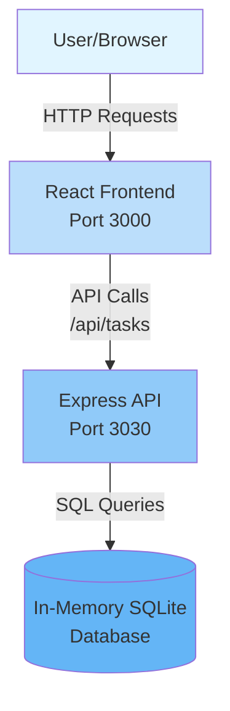
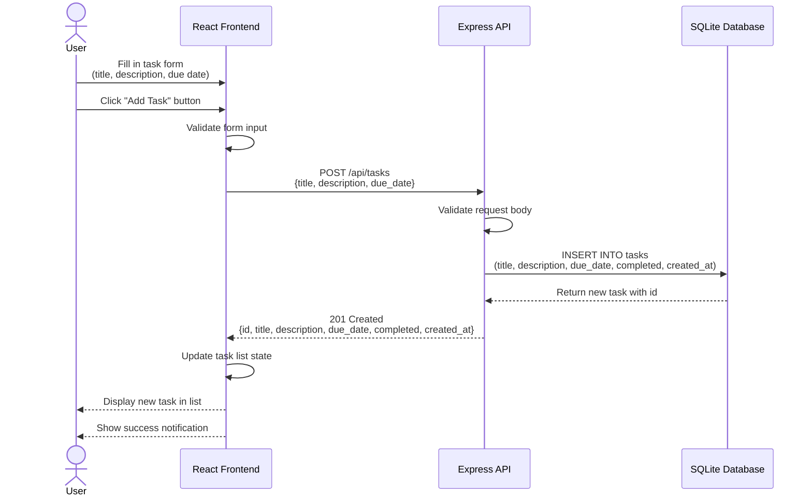

# Cloud Architecture Overview

## System Context

This document provides an architectural overview of the TODO App, a full-stack JavaScript application built as a monorepo.

### System Context Diagram

### Component Description

**User/Browser**
- End user accessing the application through a web browser
- Interacts with the React-based user interface

**React Frontend (Port 3000)**
- Single Page Application (SPA) built with React
- Provides user interface for task management
- Communicates with backend via REST API
- Proxies API requests to backend on port 3030

**Express API (Port 3030)**
- RESTful API server built with Node.js and Express
- Handles CRUD operations for tasks
- Implements filtering, searching, and sorting logic
- Exposes endpoints under `/api/tasks`

**In-Memory SQLite Database**
- Lightweight relational database running in memory
- Stores task data with schema:
  - id, title, description, due_date, completed, created_at
- Data persists only during server runtime
- No external database dependencies

### Technology Stack

**Frontend:**
- React 18
- Material UI (MUI) components
- Axios for HTTP requests

**Backend:**
- Node.js with Express.js
- better-sqlite3 for database
- CORS middleware for cross-origin requests

**Development:**
- npm workspaces for monorepo management
- Jest for testing (frontend and backend)
- Concurrently for running both services

## Sequence Diagrams

### Creating a TODO

The following sequence diagram illustrates the flow when a user creates a new TODO task:

**Flow Steps:**

1. **User Input**: User fills in the task form with title, description, and optional due date
2. **Form Submission**: User clicks the "Add Task" button to submit
3. **Client Validation**: Frontend validates the input (required fields, format)
4. **API Request**: Frontend sends POST request to `/api/tasks` with task data
5. **Server Validation**: Backend validates the request body structure and data types
6. **Database Insert**: Backend executes SQL INSERT to create new task record with default values:
   - `completed`: false
   - `created_at`: current timestamp
7. **Response**: Backend returns the newly created task with auto-generated ID
8. **State Update**: Frontend updates the local task list state with the new task
9. **UI Feedback**: User sees the new task appear in the list with a success notification
